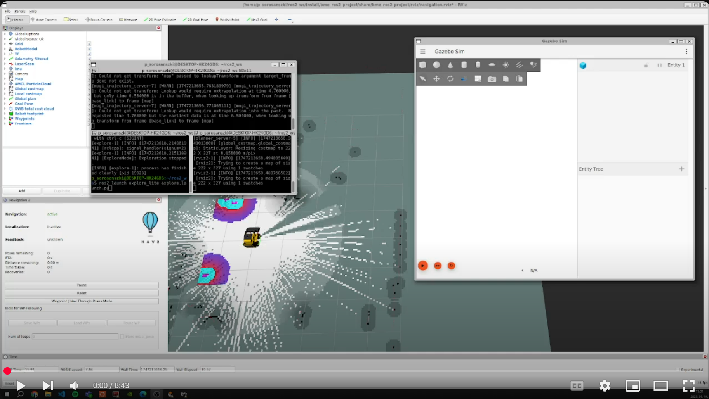

[//]: # (Image References)

[image1]: ./assets/robotmodel.png "Robotmodell"
[image2]: ./assets/environment.png "Környezet"
[image3]: ./assets/mapping.png "Feltérképezés"

# ROS 2 projekt a Robotrendszerek laboratórium tárgyra (BMEGEMINMRL)
A feladat a Budapesti Műszaki és Gazdaságtudományi Egyetem mechatronikai mérnöki MSc képzés Robotrendszerek laboratórium (BMEGEMINMRL) tantárgyához készült.

Készítette:
- Docsa Bence
- Révész Marcell
- Sorosánszki Péter

# Tartalomjegyzék
- [ROS 2 projekt a Robotrendszerek laboratórium tárgyra (BMEGEMINMRL)](#ros-2-projekt-a-robotrendszerek-laboratórium-tárgyra-bmegeminmrl)
- [Tartalomjegyzék](#tartalomjegyzék)
- [Feladatleírás](#feladatleírás)
- [Előkövetelmények](#előkövetelmények)
- [Telepítés](#telepítés)
- [Robot](#robot)
  - [Robotmodell](#robotmodell)
  - [Szenzorok](#szenzorok)
- [Környezet](#környezet)
- [Feltérképezés](#feltérképezés)
- [Futtatás](#futtatás)
- [Szimulációs folyamat](#szimulációs-folyamat)

# Feladatleírás
A projekt megvalósítása során a következő követelményeket kellett teljesíteni:
- ROS 2 navigációs stack behangolása bonyolult szimulációs környezetben
- Egy bonyolult, sűrűn berendezett szoba vagy épület feltérképezése és autonóm navigáció
- A szimuláció tartalmazzon mozgó akadályokat (pl. ember, állat)

# Előkövetelmények
- Ubuntu 24.04
    - A projekt elkészítése során WSL 2 segítségével használtuk
- [ROS 2 Jazzy](https://docs.ros.org/en/jazzy/index.html)
    - [Telepítési útmutató](https://docs.ros.org/en/jazzy/Installation/Ubuntu-Install-Debs.html)
        - A Desktop Install-t javasoljuk, mert az tartalmazza az RViz-t is
- [RViz](https://docs.ros.org/en/jazzy/Tutorials/Intermediate/RViz/RViz-Main.html)
- [Gazebo Harmonic](https://gazebosim.org/docs/harmonic/getstarted/)
    - [Telepítési útmutató](https://gazebosim.org/docs/harmonic/install_ubuntu/)
    - Szükséges a [Gazebo ROS integráció](https://docs.ros.org/en/jazzy/p/ros_gz/) telepítése:
        ```bash
        sudo apt install ros-jazzy-ros-gz
        ```
- [SLAM toolbox](https://docs.ros.org/en/jazzy/p/slam_toolbox/)
    ```bash
    sudo apt install ros-jazzy-slam-toolbox
    ```
- [ROS 2 Navigation stack](https://docs.ros.org/en/jazzy/p/navigation2/)
    ```bash
    sudo apt install ros-jazzy-nav2-map-server
    sudo apt install ros-jazzy-nav2-bringup 
    sudo apt install ros-jazzy-nav2-amcl
    ```
- Egyéb szükséges ROS 2 csomagok:
    - URDF fájlokhoz:
        - [urdf package](https://docs.ros.org/en/jazzy/p/urdf/)
            ```bash
            sudo apt install ros-jazzy-urdf
            ```
        - [urdf_launch package](https://docs.ros.org/en/jazzy/p/urdf_launch/)
            ```bash
            sudo apt install ros-jazzy-urdf-launch
            ```
    - [ros_gz_bridge package](https://docs.ros.org/en/jazzy/p/ros_gz_bridge/) a ROS és a Gazebo kommunikációjához
        ```bash
        sudo apt install ros-jazzy-ros-gz-bridge
        ```
    - [rviz_imu_plugin package](https://docs.ros.org/en/jazzy/p/rviz_imu_plugin/) az IMU vizualizációjához RViz-ben
        ```bash
        sudo apt install ros-jazzy-rviz-imu-plugin
        ```
    - [robot_localization package](https://docs.ros.org/en/melodic/api/robot_localization/html/index.html) a szenzorfúzióhoz
        ```bash
        sudo apt install ros-jazzy-robot-localization
        ```
    - [tf_transformations package](https://docs.ros.org/en/jazzy/p/tf_transformations/) koordináta-transzformációkhoz
        ```bash
        sudo apt install ros-jazzy-tf-transformations
        ```
    - [interactive_marker_twist_server package](https://docs.ros.org/en/jazzy/p/interactive_marker_twist_server/)
        ```bash
        sudo apt install ros-jazzy-interactive-marker-twist-server
        ```

- Szükséges GitHub repository-k:
    - [MOGI Trajectory Server](https://github.com/MOGI-ROS/mogi_trajectory_server) a robot pályájának megjelenítéséhez
        ```bash
        git clone https://github.com/MOGI-ROS/mogi_trajectory_server.git
        ```
    - [m-explore ROS 2 port](https://github.com/MOGI-ROS/m-explore-ros2) a teljes feltérképezéshez
        ```bash
        git clone https://github.com/MOGI-ROS/m-explore-ros2.git
        ```

# Telepítés
A projekt futtattásához ezt a GitHub repository-t kell letölteni:
```bash
git clone https://github.com/RMarci44/ROS2-project.git
```

A megfelelő működéshez a `./bme_ros2_project/launch/world.launch.py` fájl 25. sorában található `gazebo_models_path` változó értékét módosítani kell:
```bash
gazebo_models_path = "/home/.../ros2_ws/ROS2-project/bme_ros2_project/models/"
```
A `...` részletet kell módosítani úgy, hogy az elérési útvonal megfelelő legyen.

# Robot
## Robotmodell
A projekt során használt robot egy négykerekű skid steer-es munkagépet kíván reprezentálni. Ez természetesen egy kisméretű változat, amelyet most, eredeti rendeltetésétől eltérően egy szoba feltérképezésére használunk.

A robot 3D modelljét letöltöttük erről a [linkről](https://grabcad.com/library/work-machine-digger-is-makinesi-kepce-1?fbclid=IwY2xjawKTFAFleHRuA2FlbQIxMABicmlkETBrVzJKczhpVndSaXdTS0drAR6Mkte6cYbwNRm4ixdZ3KeN_tn0EXeLZJHuuNpUNY21wjH387oL5yxSEsnVeg_aem_DNsBanSorx0lSjtzF9uxBQ).

A robotmodellt a `./bme_ros2_project/urdf/mogi_bot.urdf` fájl írja le, míg a robotmodell szimulációs működését a `./bme_ros2_project/urdf/mogi_bot.gazebo` fájl tartalmazza.

Az elkészített robotmodell megtekínthető RViz-ben a `./bme_ros2_project/launch/check_urdf.launch.py` launch fájl segítségével:
```bash
ros2 launch bme_ros2_project check_urdf.launch.py
```

![alt text][image1]

## Szenzorok
A robotot az alábbi szenzorokkal láttuk el:
- Kamera
- IMU
    - Az IMU és az odometria adatait felhasználva kiterjesztett Kálmán-szűrő segítségével szenzorfúziót hajtunk végre, így pontosabban nyomon tudjuk követni a robot helyzetét.
- LIDAR
    - Egy kétdimenziós, 360°-os LIDAR segítségével tudjuk észlelni a környezetben található objektumok helyzetét.

# Környezet
A projekt során feltérképezendő terület egy sűrűn berendezett ház, amely több helyiségből áll. A szobák különböző bútorokat, tárgyakat tartalmaznak, amelyek egyik része a falak mellett helyezkedik el, másik része a falaktól távolabb. A ház továbbá tartalmaz egy embert, aki meghatározott útvonalon mozog.

A házhoz tartozó `./bme_ros2_project/worlds/small_house.world` world fájlt erről a [linkről](https://github.com/aws-robotics/aws-robomaker-small-house-world/tree/ros2?fbclid=IwY2xjawKTE5xleHRuA2FlbQIxMABicmlkETBrVzJKczhpVndSaXdTS0drAR72hp9kO0YHX3aoJYcZ1Pnm9EWOVlM9BTdRld21iFdP8w5_srZNxZsN3U1KZg_aem_jUVz9_0BWCI45Hgn_b-eTg) töltöttük le, majd néhány helyen módosítottuk.

A teljes környezet megtekinthető Gazebo-ban a `./bme_ros2_project/launch/worldlaunch.py` launch fájl segítségével:
```bash
ros2 launch bme_ros2_project world.launch.py
```

![alt text][image2]

# Feltérképezés
A projekt során a feltérképezést a SLAM toolbox segítségével valósítottuk meg. A LIDAR szenzor adataiból a környezetben található objektumokról meghatározható, hogy milyen messze helyezkednek el a robottól. Ez alapján a környezetől térkép készíthető.

Az m-explore csomagot használjuk annak érdekében, hogy a teljes területet feltérképezzük. A csomag a már feltérképezett környezet határai alapján navigálja a robotot úgy, hogy az megtalálja a rendelkezésre álló terület összes fizikai határát.

![alt text][image3]

# Futtatás
A szimuláció futtatása három részből áll:
- Gazebo szimuláció indítása:
    ```bash
    ros2 launch bme_ros2_project spawn_robot.launch.py
    ```
- Feltérképezés indítása RViz-ben vizualizálva:
    ```bash
    ros2 launch bme_ros2_project navigation_with_slam.launch.py
    ```
- A teljes rendelkezésre álló terület feltérképezése:
    ```bash
    ros2 launch explore_lite explore.launch.py
    ```
- Robot dockolása és undockolása:
    ```bash
    ros2 service call /dock std_srvs/srv/Trigger
    ros2 service call /undock std_srvs/srv/Trigger
    ```

# Szimulációs folyamat
A szimulációs folyamatot az alábbi videó szemlélteti.

<a href="https://youtu.be/N-H0o0LPKjk?si=gDq3EiiCp5Y2P5-o"></a>